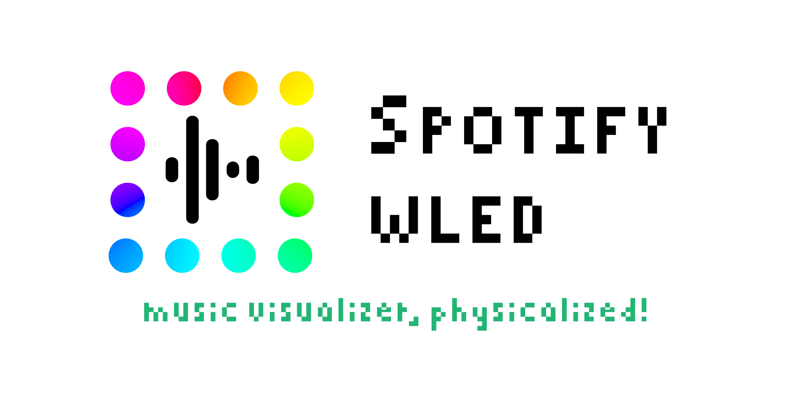

# SpotifyWLED
A not-so-simple script to listen to the currently playing track on your Spotify account and forward it to a WLED (https://github.com/Aircoookie/WLED) LED matrix.


_This was created as a fun little side project, please don't mind any less-than-stellar coding standards :)_

_(maybe I'll get around to refactoring it one day..)_

## Features
- Displays the album cover of your currently playing track
- Animations!
  - While playing, the cover pulses to the track's tempo
  - Also pulses slowly when the track is paused
  - _and a lot more to come.._


## Usage
### Spotify Developer Account Setup
1. Setup an App in your Spotify dashboard (https://developer.spotify.com/dashboard)
2. Add your active Spotify account as a user of the App
3. Add `http://localhost:8080` to `Redirect URIs` in your App


### Running the Docker Image
Pull the image from Docker Hub:

**todo**: publish image to docker hub
```
docker pull joeyywatts/spotifywled
```

Run the image, substituting the environment variables:

**todo**: mount path for spotipy credentials cache
```
docker run -d \
    -e SPOTIPY_CLIENT_ID=<your_client_id> \
    -e SPOTIPY_CLIENT_SECRET=<your_client_secret> \
    -e TARGET=<your_wled_ip> \
    -e TARGET_WIDTH=<your_wled_width> \
    -e TARGET_HEIGHT=<your_wled_height> \
    -p 8080:8080 \
    joeyywatts/spotifywled
```

Visit `localhost:8080` in your browser to authorize the app with your Spotify account, you will then be redirected to the index.

To start, click `Start Loop` in the UI.

To stop, click `Stop Loop` in the UI.


## Credits
- [Pixelated Font](https://www.dafont.com/pixelated.font) used in the logo, by [Skylar Park](https://www.dafont.com/skylar-park.d2956)
- [WLED](https://github.com/Aircoookie/WLED), by [Aircoookie](https://github.com/Aircoookie)
- [Spotipy](https://github.com/spotipy-dev/spotipy), by [Paul Lamere](https://github.com/plamere)
